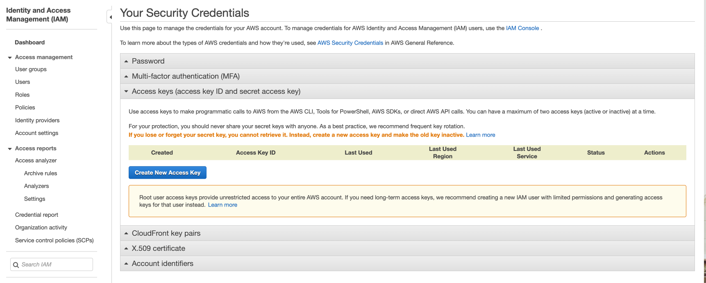
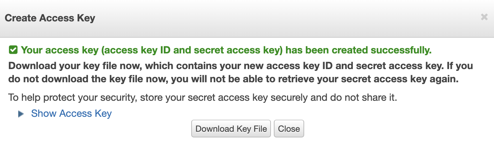
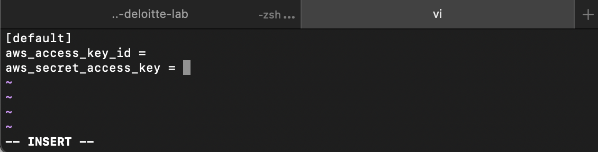
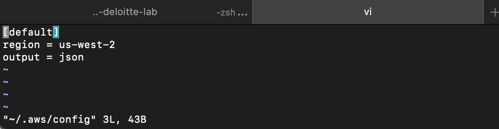

# Setting up AWS

### Prerequisite

- Python 3+
- boto3 (pip installable package, do `pip install boto3`)
- An account to AWS Console

### Getting the AWS Access Key from IAM

Log into your AWS Console, and select the top right corner, then go to Security Credentials. You'll see the page below.

Create a new access key by pressing the button `Create New Access Key`. A keypair will be automatically generated. 

Make sure to save your Access Key ID and Secret Access Key somewhere save, or download to save it. This will be the only time you'll be seeing it.

### Setting up the environment

Create a new file in `~/.aws/credential` on terminal and paste the details.

Create a new file in ~/.aws/config` and set up the default region.

