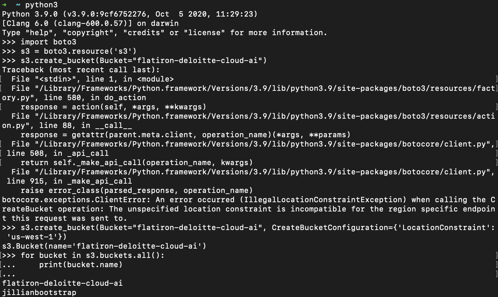

# Setting up AWS

### Prerequisite

- Python 3+
- boto3 (pip installable package, do `pip install boto3`)
- An account to AWS Console


### Getting the AWS Access Key from IAM

Log into your AWS Console, and select the top right corner, then go to Security Credentials. You'll see the page below.


Create a new access key by pressing the button `Create New Access Key`. A keypair will be automatically generated. 


Make sure to save your Access Key ID and Secret Access Key somewhere save, or download to save it. This will be the only time you'll be seeing it.

### Setting up the environment

Create a new file in `~/.aws/credential` on terminal and paste the details.


Create a new file in ~/.aws/config` and set up the default region.


### Using boto3

Let's try creating a bucket using the boto3 client and your new access key ID and Secret Key.



Open a jupyter notebook or a python console from terminal.

```
import boto3

s3 = boto3.resource('s3')
s3.create_bucket('your_bucket_name')

# if your region is different than us-east-1,
# you need to specify the region when creating the bucket like in the image

# s3.create_bucket(Bucket='your_bucket_name', 
# CreateBucketConfiguration={'LocationConstraint': 'us-west-1'})
# available regions https://docs.aws.amazon.com/general/latest/gr/s3.html
```